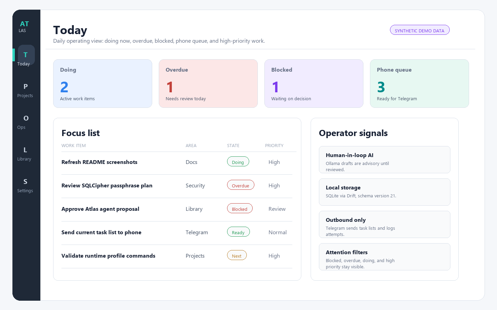
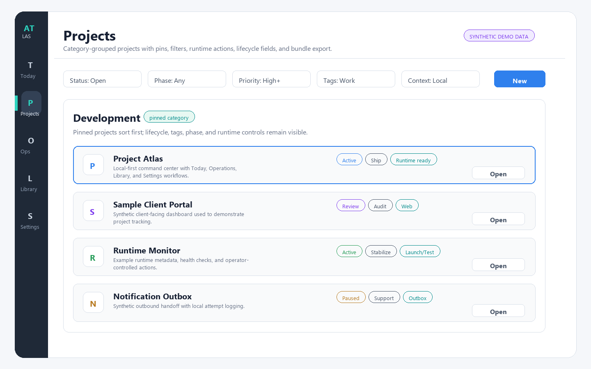
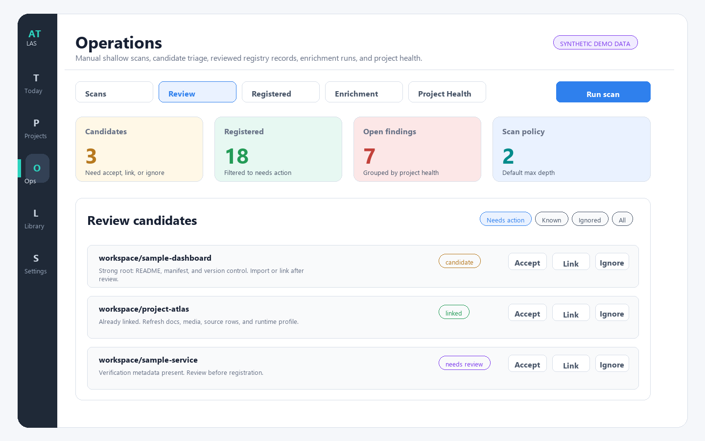
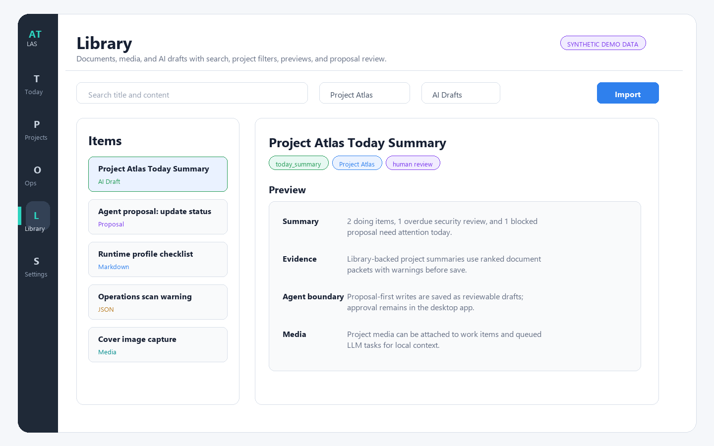
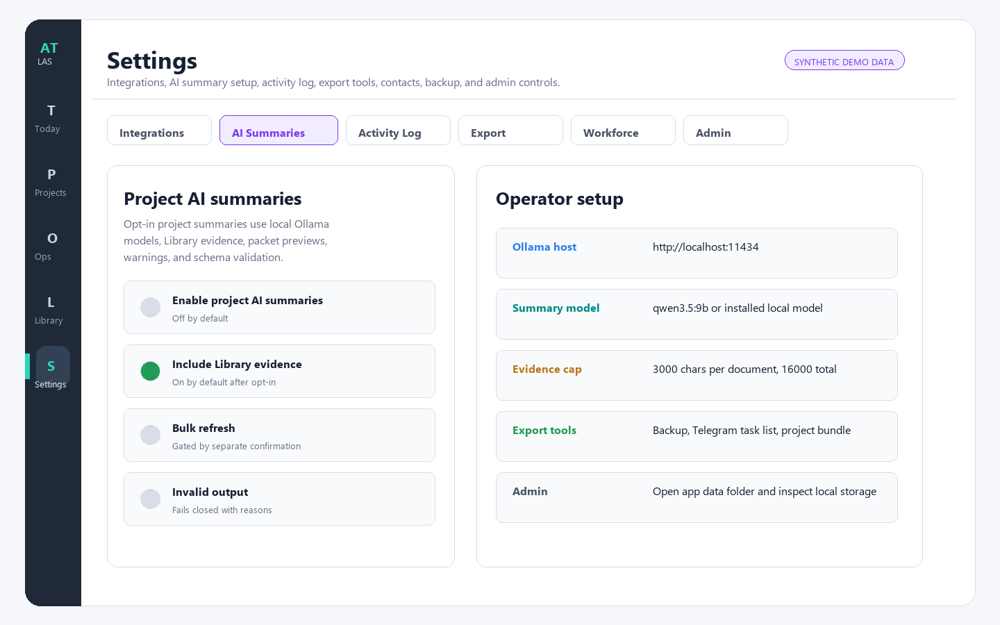

# Project Atlas

Project Atlas is a local-first project command center for Windows, built with
Flutter and backed by SQLite. It brings planning, project health, documents,
runtime actions, and review-gated AI assistance into one desktop application.

Created and maintained by [Paul Peck](https://github.com/ppeck1).

> Privacy note: this public repository contains synthetic demo fixtures and
> generated UI mockups only. It does not publish the author's project
> inventory, machine paths, operational records, contact data, or credentials.

## What it demonstrates

- A feature-rich Windows desktop UI with Today, Workboard, Projects,
  Operations, Library, Review, Export, and Settings surfaces.
- A local SQLite data layer using Drift, migrations, repository-style queries,
  and explicit timestamp contracts.
- Manual project discovery and health review with shallow scans, candidate
  triage, local refresh previews, and auditable findings.
- Searchable document and media import with format-aware previews.
- Operator-defined runtime profiles for launch, stop, test, URL, port, and
  health-check actions. Commands are stored by the operator and never invented
  or run automatically by Atlas.
- Local Ollama summaries and an LLM task queue with evidence packets,
  proposal-first writes, leases, review drafts, and failure-closed parsing.
- A local MCP interface plus a separate, deny-by-default remote projection
  layer that exposes only approved aliases and fields.
- Optional outbound integrations for GitHub metadata and Telegram task-list
  delivery, both initiated by the operator.

## Screenshots

These images are generated mockups containing invented data; they are not
captures of a live workspace.

| Today | Projects |
|---|---|
|  |  |

| Operations | Library |
|---|---|
|  |  |

| Settings |
|---|
|  |

## Local-first boundary

Atlas stores its application database and imported document copies on the
local machine. It has no telemetry, analytics, hosted account, or cloud sync.
Data leaves the machine only when an operator explicitly uses an enabled
integration. The SQLite database is currently plaintext; see
[SECURITY.md](SECURITY.md) before storing sensitive material.

The remote MCP gateway is intentionally narrower than the trusted local MCP
surface. Its disclosure policy is ignored by Git, deny-all when empty, and
requires separate inventory and detail approval. See
[docs/MCP_SECURITY_MODEL.md](docs/MCP_SECURITY_MODEL.md).

## Quick start

Prerequisites: Windows 10 or 11, PowerShell, and Flutter stable.

```powershell
git clone https://github.com/ppeck1/project-atlas.git
cd project-atlas
flutter pub get
dart run build_runner build --delete-conflicting-outputs
flutter run -d windows
```

The repository also provides `launch.ps1` for the normal Windows development
flow:

```powershell
.\launch.ps1 -Full  # first run or generated-code refresh
.\launch.ps1        # later runs
```

## Verification

```powershell
dart run build_runner build --delete-conflicting-outputs
flutter analyze
flutter test
flutter build windows --release
python -m unittest discover -s tools -p "test_*.py" -v
```

GitHub Actions runs code generation, Python policy tests, Flutter analysis, the
full Flutter test suite, a Windows release build, and an MCP smoke test.

## Repository guide

- `lib/features/` - desktop screens and interaction flows
- `lib/db/` - Drift tables, migrations, queries, and document extraction
- `lib/services/` - project refresh, runtime, AI, GitHub, and integration logic
- `lib/mcp/` - trusted local MCP adapter and stdio server
- `tools/` - remote projection, gateway, smoke, and maintenance utilities
- `test/` - unit, widget, migration, policy, and adapter coverage
- `demo/` - explicitly synthetic import fixtures
- `docs/` - architecture, data model, security model, and focused feature notes

## Design notes

- [Architecture](docs/ARCHITECTURE.md)
- [Data model](docs/DATA_MODEL.md)
- [MCP security model](docs/MCP_SECURITY_MODEL.md)
- [Shopify SEO review workflow](docs/SHOPIFY_SEO_REVIEW.md)
- [Demo walkthrough](DEMO.md)
- [Contributing](CONTRIBUTING.md)

## Current limitations

- Windows is the supported desktop target.
- The local SQLite database and configured integration secrets are not
  encrypted at rest.
- AI quality depends on the locally selected Ollama model.
- Runtime actions execute operator-provided commands and therefore require the
  same care as running those commands in a terminal.
- Remote MCP access requires operator-managed OAuth, tunneling, and a local
  disclosure policy; this repository does not host a shared gateway.

## License

MIT. See [LICENSE](LICENSE).
