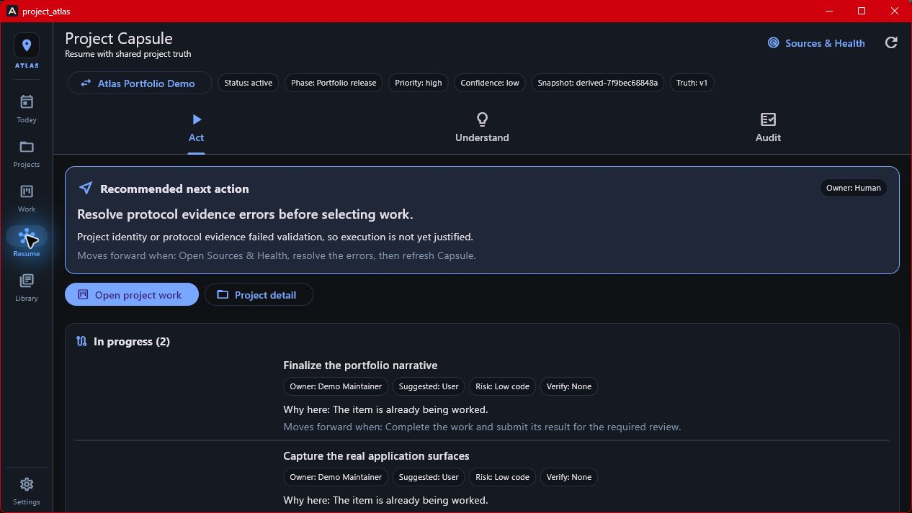
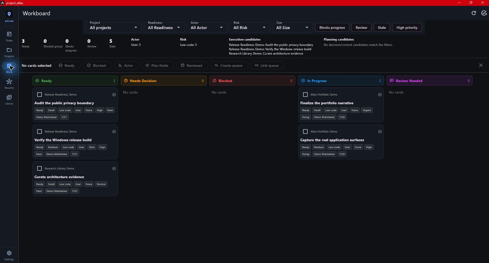
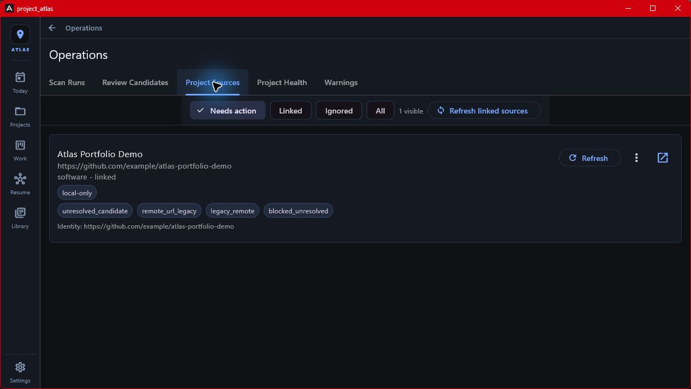

# Project Atlas

**A local-first Windows command center for resuming projects, choosing the next
justified action, and collaborating with review-gated AI.**

Project Atlas is a Flutter desktop application backed by Drift and SQLite. I
built it to make complex project work legible without moving the working record
into a hosted service. It combines day-to-day execution with auditable project
state, evidence, and deliberately constrained automation.

Created and maintained by [Paul Peck](https://github.com/ppeck1).


_Actual Project Atlas Windows capture. Every screenshot in this README comes
from the running application using an isolated, public-safe demo database._
The capture set is refreshed against the current release build and includes the
same navigation, source-topology, and theme surfaces described below.

## Portfolio snapshot

| Area | What this repository demonstrates |
|---|---|
| Product design | One desktop workflow spanning Capsule, Today, Workboard, Projects, Sources & Health, Library, Review, and Settings |
| Desktop engineering | Flutter for Windows, responsive information-dense surfaces, navigation, dialogs, and long-lived local state |
| Data integrity | Drift/SQLite persistence, schema migrations, timestamp contracts, linked sources, documents, and repository-style queries |
| Governed automation | Operator-defined runtime actions, proposal-first AI writes, leases, review drafts, and auditable outcomes |
| Security boundaries | Local-first storage, no telemetry, ignored local policy files, and a deny-by-default remote MCP projection |
| Delivery discipline | Automated analysis, unit/widget/policy tests, Windows release builds, artifact scanning, and MCP smoke coverage |

## Product surfaces

### Resume from accepted project truth

Capsule brings intent, accepted state, current work, decisions, risks, evidence
posture, and the recommended next action into one progressive-disclosure
surface. Its Act, Understand, and Audit views share one live snapshot revision,
while the authored project contract has a separate accepted revision.

Humans can edit the authored contract, inspect every changed field, and then
explicitly save it as accepted truth. Atlas appends immutable revision history
and rejects stale saves. Agent-originated changes continue through the proposal
review queue; they cannot silently become accepted state.



### Plan the day without losing project context

The Today view rolls up work that is in progress, overdue, due soon, blocked,
or high priority. Items remain grouped by project and can be filtered without
flattening the underlying ownership and evidence.


### Turn project state into an execution queue

The Workboard separates ready work, decisions, blocked items, and work in
progress. Readiness, actor, risk, size, review state, and verification needs are
first-class planning fields rather than free-form conventions.



### Reconcile sources before refreshing evidence

The secondary Sources & Health surface separates canonical Atlas projects from
the source rows that support them. Source topology chips make local working
folders, legacy remote URLs, ignored rows, and unresolved authority visible
before a refresh can change Atlas bookkeeping.



### Keep source material beside the work

The Library imports and previews project-linked documents while preserving the
local-first boundary. Search and project filters make technical evidence
available without turning a project brief into an untraceable summary.


## What I built

- A project model with outcomes, scope, phases, priorities, risks, decisions,
  people, tags, media, and linked evidence.
- A versioned Project Capsule with reviewed human edits, immutable accepted
  history, stale-write protection, and distinct live-snapshot and truth
  revisions.
- A workload model that distinguishes execution-ready work from blocked,
  stale, review-dependent, and decision-dependent items.
- Project discovery and health review with shallow scans, candidate triage,
  source topology, reconciliation previews, findings, and operator acceptance.
- Searchable document and media import with format-aware extraction and
  Markdown previews.
- Runtime profiles for launch, stop, test, URL, port, and health-check actions.
  Atlas stores commands supplied by the operator; it does not invent or run
  commands automatically.
- Local Ollama summaries and an LLM task queue with evidence packets,
  proposal-first writes, leases, failure-closed parsing, and review drafts.
- A trusted local MCP interface and a separate remote projection that exposes
  only approved tools, aliases, projects, and fields.
- Optional outbound GitHub metadata and Telegram task-list integrations,
  initiated by the operator.

## Architecture choices

| Decision | Why |
|---|---|
| Local SQLite is the source of truth | Projects, documents, drafts, and evidence remain usable offline and under the operator's control |
| UI, services, database, and MCP layers are separated | Each boundary can be tested and constrained independently |
| AI output enters as proposals | Generated content cannot silently become accepted project state |
| Runtime commands are operator-authored | Automation remains explicit and reviewable |
| Remote MCP is narrower than local MCP | Public or connector-facing access cannot inherit the trusted desktop surface by accident |
| Synthetic capture fixtures are reproducible | Portfolio images can show the real app without publishing a private workspace |

See [Architecture](docs/ARCHITECTURE.md), [Data model](docs/DATA_MODEL.md),
and [MCP security model](docs/MCP_SECURITY_MODEL.md) for the implementation
details behind those decisions.

## Stack

- Flutter and Dart for the Windows desktop application
- Drift and SQLite for relational local persistence and migrations
- Python for the authenticated MCP gateway, disclosure policy, and smoke tools
- GitHub Actions for code generation, analysis, tests, release builds, and MCP
  verification
- Ollama for optional local model execution

## Privacy and trust boundary

Atlas has no hosted account, analytics, telemetry, or cloud sync. Data leaves
the machine only when an operator explicitly invokes an enabled integration.
The local SQLite database is currently plaintext, and configured integration
secrets are stored locally; review [SECURITY.md](SECURITY.md) before using real
sensitive material.

The Settings portable export is useful for inspection and selective transfer,
but it is not a complete backup and cannot restore an Atlas instance. Full
backup-and-restore remains a separately scoped recovery feature.

Example data in the public repository is limited to demo fixtures and the real
application captures shown above. Those captures were made from an isolated
demo database, not the maintainer's working Atlas data.

## Try it

The latest verified Windows package is available from
[Releases](https://github.com/ppeck1/project-atlas/releases/latest).

To build from source, use Windows 10 or 11 with Flutter stable:

```powershell
git clone https://github.com/ppeck1/project-atlas.git
cd project-atlas
flutter pub get
dart run build_runner build
flutter run -d windows
```

The normal development launcher is also available:

```powershell
.\launch.ps1 -Full  # first run or generated-code refresh
.\launch.ps1        # later runs
```

## Verification

```powershell
dart run build_runner build
flutter analyze
flutter test
flutter build windows --release
python -m unittest discover -s tools -p "test_*.py" -v
```

GitHub Actions additionally compiles the gateway scripts, seeds an isolated
database, and exercises the MCP gateway against the built Windows executable.

## Repository guide

- `lib/features/` — desktop screens and interaction flows
- `lib/db/` — Drift schema, migrations, queries, and document extraction
- `lib/services/` — project refresh, runtime, AI, GitHub, and integrations
- `lib/mcp/` — trusted local MCP adapter and stdio server
- `tools/` — remote projection, gateway, capture fixture, smoke, and maintenance
- `test/` — unit, widget, migration, policy, and adapter coverage
- `demo/` — explicitly synthetic import fixtures
- `docs/` — architecture, data model, security, and maintainer references

## Maintainer references

- [Variable matrix](docs/VARIABLE_MATRIX.md)
- [Public maintainer handoff](HANDOFF.md)
- [Demo walkthrough](DEMO.md)
- [Contributing](CONTRIBUTING.md)
- [Security policy](SECURITY.md)

## Current limitations

- Windows is the supported desktop target.
- The local database and saved integration secrets are not encrypted at rest.
- The Settings portable export is not a complete backup and has no restore
  workflow yet.
- AI quality depends on the locally selected Ollama model.
- Runtime actions execute operator-provided commands and require the same care
  as running those commands directly.
- Remote MCP access requires operator-managed authentication, tunneling, and a
  local disclosure policy; this repository does not host a shared gateway.

## License

MIT. See [LICENSE](LICENSE).
